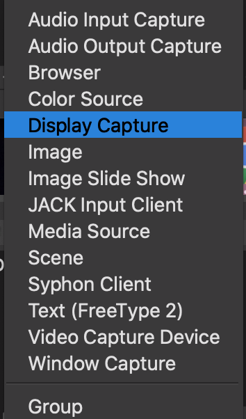

# Streaming your ASRG Meetings

## Reasons to do this.

There are a few reasons you might look to virtualize a meetup:

1\) You want to allow remote-access to an in-person meetup.\
2\) You want to record your meetup so it can be rewatched on a platform like YouTube Live. \
3\) A coronavirus completely ruins all hope of meeting in person, and you want to still add value to your local ASRG members!&#x20;

## What you need.

To get going, you'll need to achieve the following tasks:

* Hardware to capture audio (presenter talking, possibly discussion of members).&#x20;
* Hardware to capture the presentation (screenshare ONLY, there's no need to capture video as it introduces privacy concerns for our members).&#x20;
* Some software that can stream.&#x20;
* A streaming platform that allows for DVR (saving of the live stream).&#x20;
* Someone to interact with those people that join the livestream!

## Recommended Setup

Through trial and error, the early ASRG chapters found a few effective ways to achieve remote presentations! We recommend the following setup:

1. Capture audio **for both presenter and discussion of meetup members.**
   1. RODE Wireless GO to capture presenter's voice (wifi mic): [http://en.rode.com/wireless/wirelessgo](http://en.rode.com/wireless/wirelessgo)
   2. Jabra 410 omnidirectional mic to capture questions and discussion from audience (point it away from presenter!): [https://www.jabra.com/business/speakerphones/jabra-speak-series/jabra-speak-410#/#7410-109](https://www.jabra.com/business/speakerphones/jabra-speak-series/jabra-speak-410#/#7410-109)
2. Install OBS to capture audio inputs/outputs, screenshare and connect to a streaming service: [https://obsproject.com/](https://obsproject.com)
3. Use the ASRG YouTube account (request permission) to host the live stream.
4. Distribute the link to your Meetup members!

## Getting Going!

1. Test your hardware. Connect the mics to your computer and assure it recognizes them as an audio source.&#x20;
2. Open OBS.&#x20;
3. Add your audio inputs via Audio Input Capture:

&#x20;   4\. Add your screen share

.png>)

&#x20;   5\. Go to YouTube, sign in, switch accounts to one w/ ASRG permissions, and enter the YouTube studio by hovering over the small camcorder and clicking "Go live":

.png>)

&#x20;  6\. Create a new stream. Usually, name it similar to what you would have named the meetup. Now, ensure DVR is enabled, grab the stream key and URL:

.png>)

&#x20;   7\. Go to settings in OBS, then "stream", and enter the relevant stream server/key:

.png>)

&#x20;   8\. Click "Start streaming" in OBS, and verify that it connects properly to YouTube live. If the audio looks OK, then go ahead and GO LIVE in YouTube Studio! Make sure you're paying attention to audience questions!
