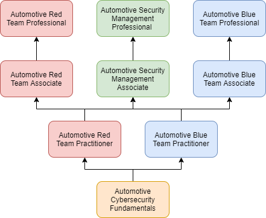

# Skills Roadmap

## Skills Specialties 

What are the specific specialties or paths we are interested in? Learning paths should probably follow a branched method with all paths originating from the same basic skills.

* 
## Skills List

What individual skills are we covering? We should be granular and then the skills can be grouped by learning path later.

* Communications
  * Wired
    * Controller Area Network \(CAN\)
    * Flexray
    * Ethernet
    * LIN
    * MOST
  * Wireless
    * WiFi 6E \(V2X\)
    * Bluetooth
    * Cellular
* Sensors
  * Localization
    * Camera
    * Lidar
    * Radar
    * GPS
  * Wheel Speed
    * Hall
    * Reluctance
    * Optical
  * ...
* 
