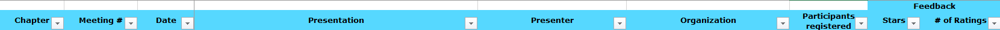

# MeetUp Event Planning

### Meeting Overview and **Feedback**

MeetUp provides a functionality to get feedback from the RSVPed participants of an Event. By collecting this kind of information we will be able to receive an impression which topics are interesting for the community. That is why we should take this information and put it together.

#### **How to find the information?**

You need to be _**host**_ of the event you want to read out the information and the event itself must be taken in the past. If you open the event page you find on the right side a menu button _**organizer tools**_. By open the menu there appears the menu item _**watch feedback**_ where finally the information is available.

#### Where to put this information?

On the [Google Management Drive](https://drive.google.com/drive/folders/0AKBFWkVRmHAMUk9PVA) is an excel sheet available where all events are listed. It is stored inside the folder [`../50. Events/01. MonthlyEvents/`](https://drive.google.com/drive/folders/1JA9lUn9x2m6Jy3YdTpyxRqpP\_hsVPUyC) under the name **PresentationOverview.xlsx**. By open this file you can look for the event you want to put the information and write it there. The following self-explanatory columns are available there:

